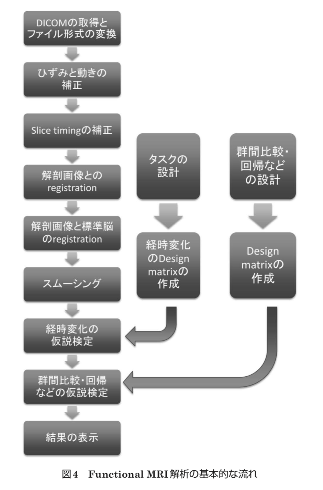
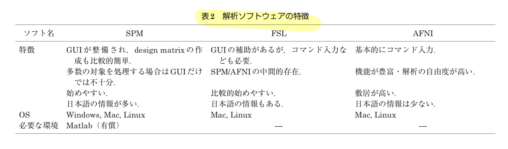

# タイトル
1. 著者 松下明
2. 研究機関 茨城県立医療大学
3. 発行年 2016年　医学物理 第36巻  
4. [URL](https://www.jstage.jst.go.jp/article/jjmp/36/2/36_92/_pdf/-char/ja)  
5. 編集 20190608  

## ジャンル  
解説論文  

# なぜ読もうと思ったのか
fMRIについて調べていたら、見つけた。  
fMRIの解析・基本的なことを知りたい。  

# この論文について基本事項  

神経血管カップリングの発見により、脳の活動と局所血流量に対応関係があることが分かった。  
続く、BOLD効果の発見により、磁化率効果を用いて局所血流量変化がMRIでも捉えるようになった。  

## fMRIのタスク  
fMRIの特徴は、タスクと言われる刺激を行う。  
知りたい脳機能をあぶり出すような作業を行う。  

神経血管カップリングには脳活動が賦活されてから脳血流が最大になるまでに数秒のタイムラグがあることが知られている。  
同様に賦活後もゆっくりと脳血流が減少する。  

賦活そのものを対象とした「領域」の研究から、この領域を結びつける「ネットワーク」を対象とする研究が主流になりつつある。  

## fMRI解析の基本的な流れ

## fMRI解析のソフトウェア

