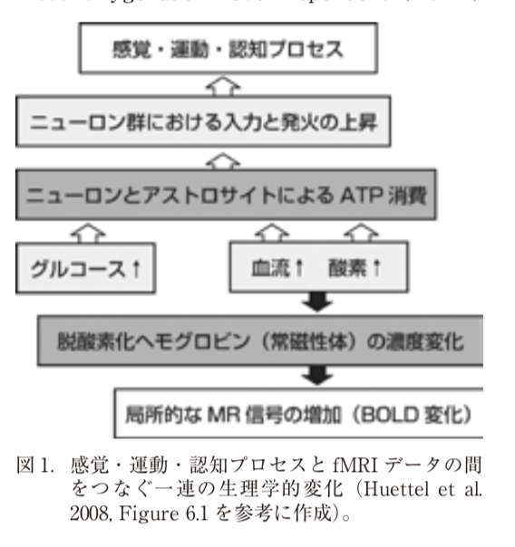
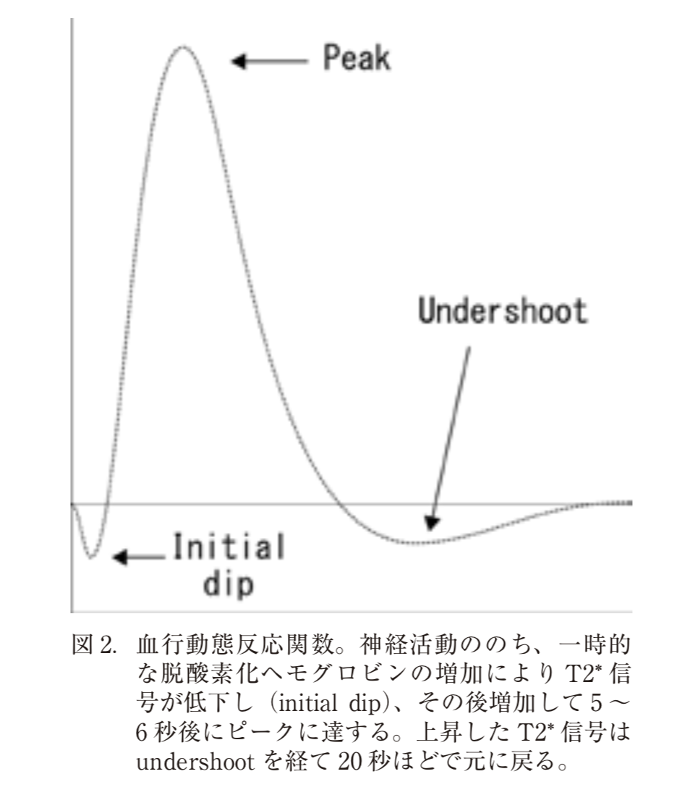

# タイトル
1. 著者 岩渕俊樹  
2. 研究機関 国立障害者リハビリテーションセンター  
3. 発行 埼玉放射線vol64 No3 2016  
4. [URL](http://www.sart.jp/wp/wp-content/uploads/2016/11/6.Gakujututokushu.pdf)  
5. 編集 20190608  

## ジャンル
学術特集  

# なぜ読もうと思ったのか
fMRIについて調べるため  

# ノート
機能的な脳活動に関連するMRI信号の変化を検出することで、非侵襲的に脳機能を計測する方法がfMRIである  

fMRIは神経活動それ自体を計測するのではなく、神経活動と相関する生理的変化を検出することで、間接的に脳活動を計測する。  

BOLD信号の変化は神経活動そのものではなく、神経的な応答に付随する血流動態および代謝的変化に起因する。  
脳内で情報処理が起こると、ニューロンが活動するが、この活動はエネルギー供給のためアデノシン三リン酸(ATP)を必要とする。  
ATPの産生にはグルコースが酸素によって解糖されることが必要なので、ニューロンが活動すると酸素と糖の代謝活動が生じる。  
この酸素と糖の供給により、神経活動がました部位での局所脳血流が増加する。  
局所脳血流が変化すると、それに伴って血中の酸素化ヘモグロビン濃度が増し、脱酸素化ヘモグロビン濃度が減少する。  
酸素化ヘモグロビンが反磁性であるのに対し、酸素分子と結合していない脱酸素化ヘモグロビンは常磁性を持つ。  
常磁性体である脱酸素化ヘモグロビンの含有量に伴って、磁気共鳴信号が変化することをBOLD効果と呼ぶ。  

血流動態反応関数(hemodynamic response function:HRF)

HRF自体はあくまで経験的に導かれたモデルであり、神経活動とBOLD信号変化の正確な関係については不明な点も多い。  

「fMRIで人間の脳機能を調べる」というとき、我々は暗黙裡に１つの前提条件を受け入れている。  
「脳内で機能は空間的に分離しており、ある機能はこの領域が担当し、別の機能は別の領域が担当するといった具合に局在化されている」ということである。  
脳内における機能局在は神経心理学の研究によって支持されてきたが、fMRIやPETに代表される脳機能イメージング技術の発展に伴い、ますます多くの実験的証拠が積み重ねられてきている。  

[Neural correlates of interspecies perspective taking in the post-mortem Atlantic Salmon: An argument for multiple comparisons correction]  

# fMRI研究のさらなる発展
## 領域間結合の分析  
GLMを用いたfMRI分析は、脳の機能局在を前提とした上で、認知・感覚・運動などの諸機能と相関する脳部位を検出するというもの。  
脳内のある部位は他の部位は他の部位から独立して機能しているわけではなく、むしろ機能的なネットワークの一部として他の部位と協働して働いている。  
fMRIデータに基づく結合性分析によって、このような脳内のネットワークを調べることができる。  

結合性分析には、機能的結合(functional connectivity)と実効的結合(effective connectivity)の２種類ある。  
1. 機能的結合  
２つの領域間におけるBOLD信号変化の相関を調べる手法  
この手法では結合の方向性を評価することはできない。  
活動が同期的に変化する領域軍を同定することができる。  

安静時fMRI(resting-state-fMRI)が近年盛んである。  

2. 実効的結合  
グレンジャー因果性分析と動的因果モデリングの２つある。  

[]  
[]  

## マルチボクセル・パターン分析  
単一voxelごとに条件間で脳活動の大きさを比較するのではなく、多数のvoxelが示す信号の空間的パターンを分析することで、どのような情報が脳内で表現されているかを調べる手法が提案されている。  

マルチボクセル・パターン分析(multi-voxel pattern analysis: MVPA)と呼ばれる。  
複数のvoxelが示す空間的パターンの違いを識別することができる。  
[]

MVPAは脳内の情報表現を調べられるというだけでなく、脳活動に基づいて認知的・感覚的な内容を解読でき可能性がある。  
[]  

## ニューロフィードバック  
fMRIデータをリアルタイムで分析し、その結果を被験者自身にフィードバックする手法  
[]
# 気になる参考文献
