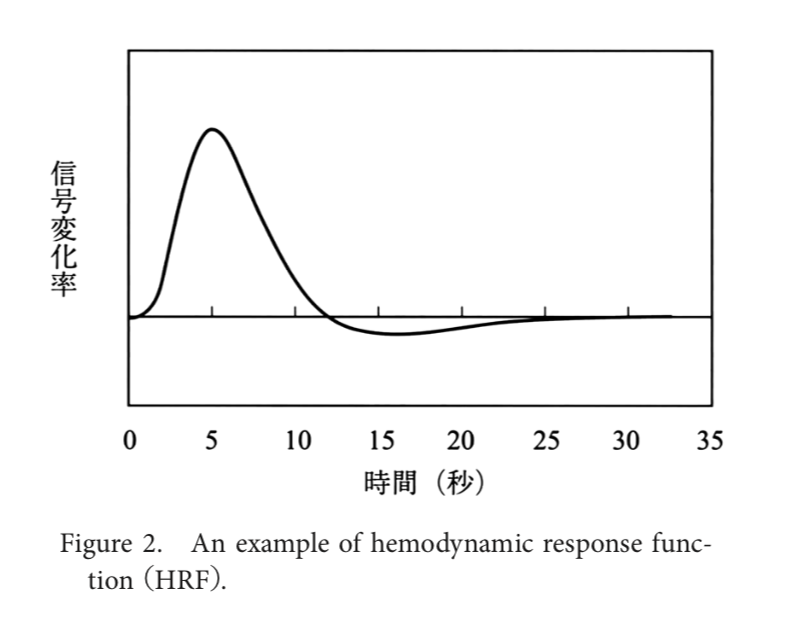
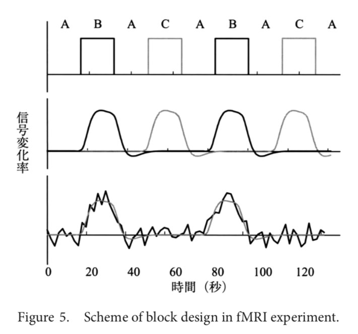
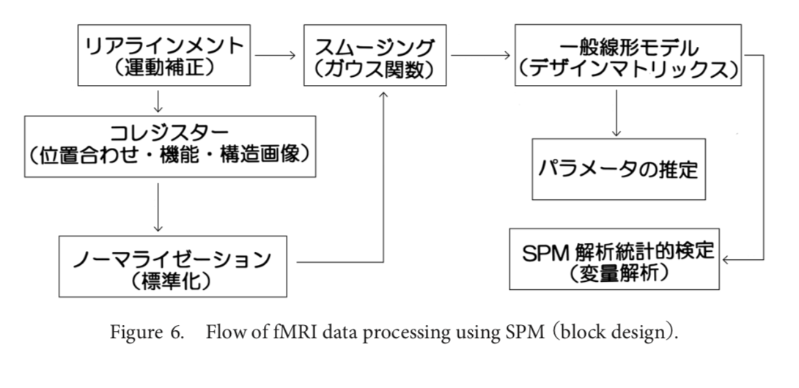
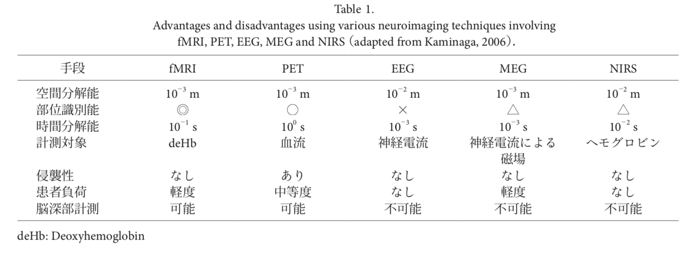

# 実験心理学からみた機能的磁気共鳴画像法(fMRI)による脳画像解析
1. 著者 苧坂直行 矢追健
2. 研究機関 京都大学
3. 発行 the Japanese Journal of Psychonomic Science
4. [URL](https://www.jstage.jst.go.jp/article/psychono/34/1/34_34.29/_pdf/-char/ja)  
5. 編集2019/06/08    

## ジャンル
解説論文  

# なぜ読もうと思ったのか
fMRIについて調べた  

# この論文について基本事項  
ヒトの大脳には一千億を超えるニューロンが神経ネットワークを形成しており、それらのネットワークは相互に作用しあって認識や行動、そして意識を生み出している。  
脳の働きが、様々な心や意識に働きと密接に相関することはよく知られている。  
脳と意識がどう関わるかについての問題は一般に、NCC(neural correlates of consciousness)問題として取り上げられ、
ヒトの脳についても脳波やfMRIなどを用いた実験で検討されてきた。  

## 血流動態  
脳のニューロン集合の活動を、それを支える血流によって間接的に捉える方法がある。  
脳が正常に働くには、その神経系を形成するニューロン群に酸素を供給する必要がある。  
もし、脳内の局所血流動態が的確に観察できるなら、NCC仮説に従って血流と相関するニューロン集合がそのような心的機能の働きと関わることがわかる。  

fMRIは脳の血流動態を観測する。脳の神経系を形作るニューロン集団の電気的活動を直接観察しているのではないことに注意が必要である。  
知りたいのは血流動態の観察を通したニューロン集団の活動なのであるが、現在のところその相互の因果的関係を厳密に証明したデータは残念ながらないのである。  

神経活動に伴う血流増加は局所的に生じるが、その増加はゆっくりしており5秒程度の時間的遅れが生じる。  
その後、20~30秒程度を経てようやく反応は元のベースラインに戻る。  
これはfMRIの時間解像度の低さの原因ともなっている。  

## 実験  
実験時間に特に技術的な制約はないが、長時間にわたる実験は集中力の低下や強い眠気をもたらす可能性があるため望ましくない。  

fMRIは空間的な解像度が高い反面、撮像中に被験者の頭部が動くと正しく分析することが難しくなる。  

実験デザインの種類
+ ブロックデザイン  
+ 事象関連デザイン  
+ 高速事象関連デザイン

## 解析方法  
  

### SPM
FWEファミリーワイズエラー  
FDRフォールスディスカバリレート  

多重比較補正を行った時の検定を、correctedと呼ぶ。  
各ボクセルが独立であると想定した場合の検定をuncorrectedと呼ぶ。  

uncorrectedでは多数のボクセルに対して独立した検定を行うため、統計的な信頼性に欠けると考えられており、*論文でもこれを用いると注文がつく* 場合がある。  

多重比較補正を行う必要があるが、FWEでは基準が厳しすげて有意な活動領域がほとんど見出せないことが往往にしてある。  
ボクセルレベルのuncorrectedで活動が示されたクラスターに対し、クラスターレベルでの多重比較補正を行うことによって、活動領域の推定を行う場合もある。  

## ニューロイメージングの測定法の特徴

# 気になる参考文献
1. [Coactivation of the default mode network regions and working memory networking memory network regions during task preparation:An event-related fMRI study.]()

2. []
